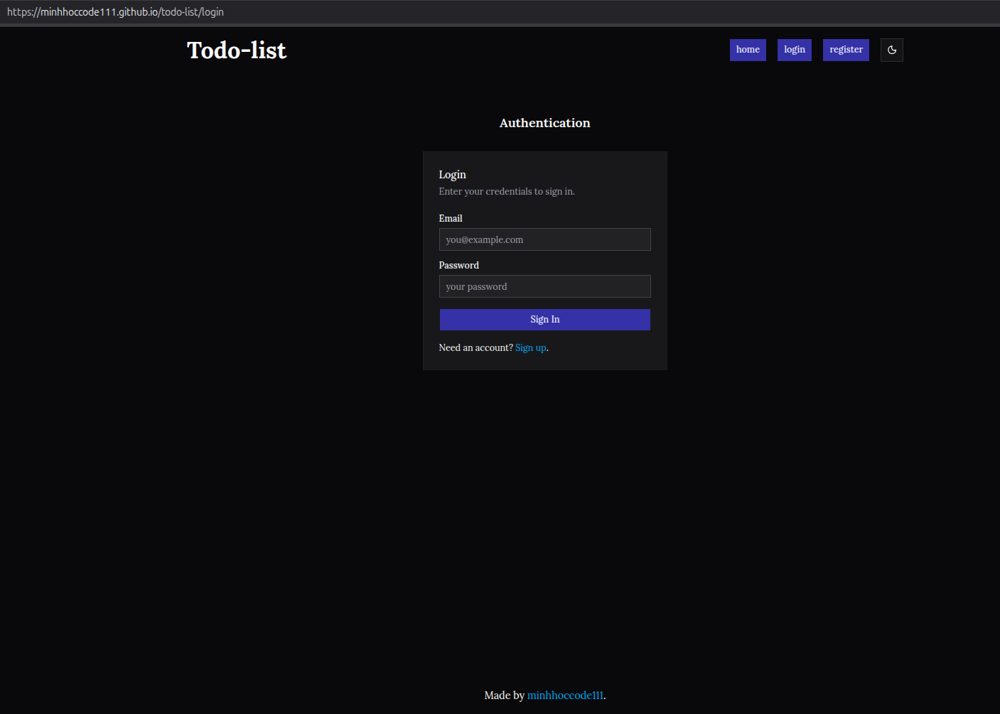
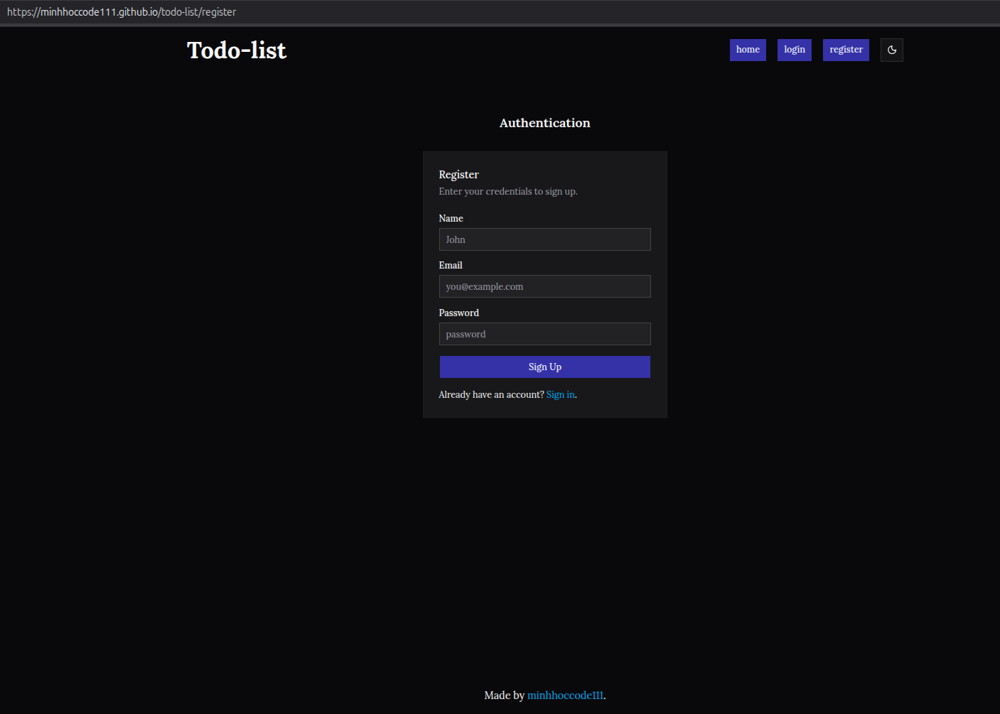
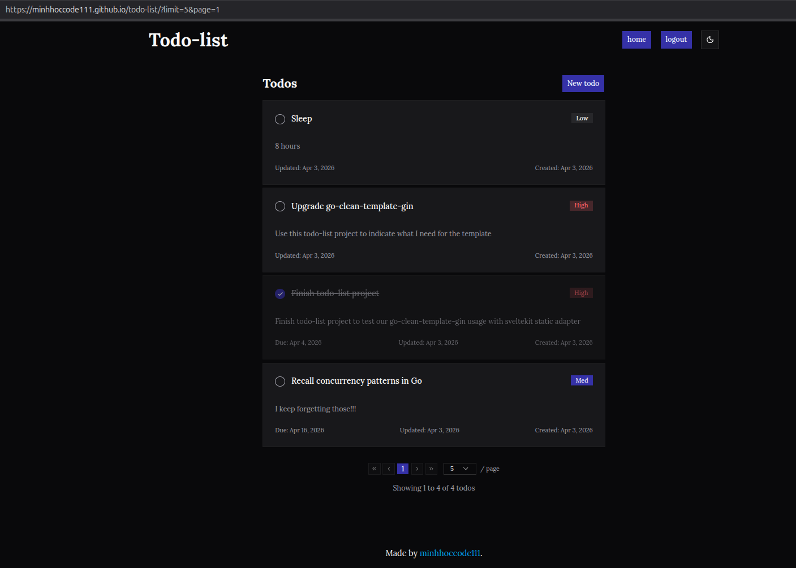
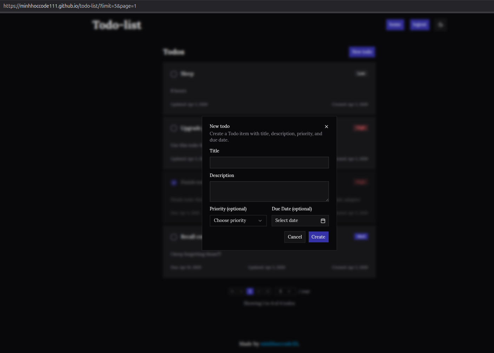
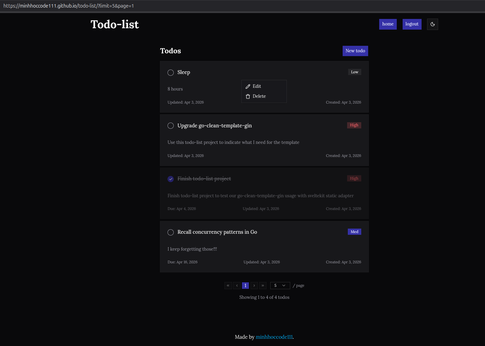
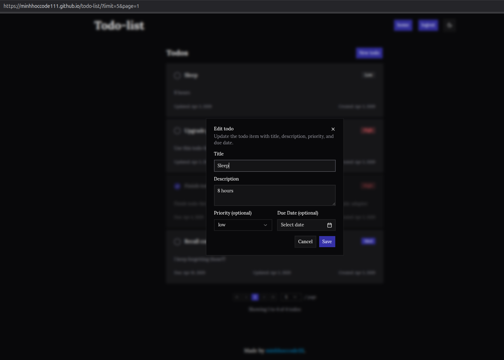
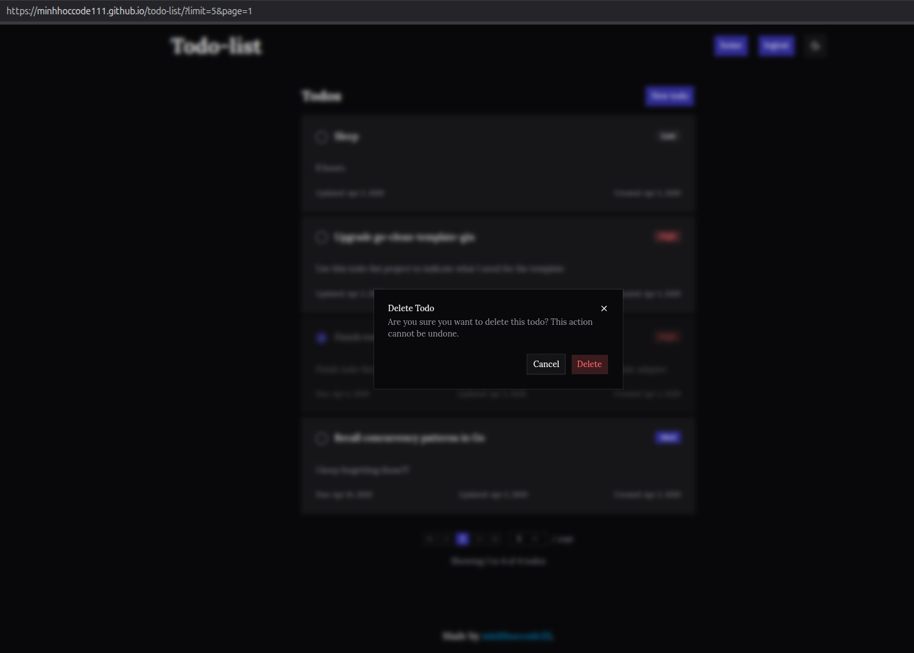

# Todo List

## Learned Concepts

- Apply middlewares at global-level (engine-wide), router-group-level, and route-level
- `sqlc`
- `otter` cache
- We don't need to check for `userID` to exist before using it as foreign key
  to insert `todos`, the database will automatically return error if the
  reference `userID` doesn't exist in `users` table
- refresh tokens
  - `/login` and `/register` now set http-only cookies with refresh tokens, alongside access tokens
    - refresh tokens don't need to be JWT, because refresh tokens don't need to extract user_id, expired_at in the claims like JWT, everything can be retrieved from the database
    - refresh tokens will be hashed and stored in database on our server to be able to revoke anytime
    - refresh tokens should be sent in http-only cookies
    - setup frontend to automatically try `/refresh` with `afterResponse` hooks when `401` happens
  - `/refresh`: takes refresh token then return new access token and refresh token and invalidate the used one
  - `/logout`: logout current session via http-only cookies
  - `/logout/all`: logout all device sessions
  - `/logout/:id`: logout a device by its session id
- rate limit per IP
- unit tests
- sveltekit feels great

## Todo

- [x] register endpoint
- [x] login endpoint
- [x] auth middleware
- [x] create todo
- [x] update todo
- [x] delete todo
- [x] read todos paginate
  - [x] add cache (`~8.00 ms` → `500.00 µs`)
- [x] bearer auth for swagger
- [x] add SPA frontend using sveltekit adapter static
- [x] add refresh token
- [ ] rate limit per IP
- [ ] unit tests

## Preview

  
Click me

## Resources

- [Project Requirements](https://roadmap.sh/projects/todo-list-api)
- [Refresh Tokens - What are they and when to use them](https://auth0.com/blog/refresh-tokens-what-are-they-and-when-to-use-them/)
  - refresh token is a credential artifact that lets a client application get new access tokens without having to ask the user to login again
